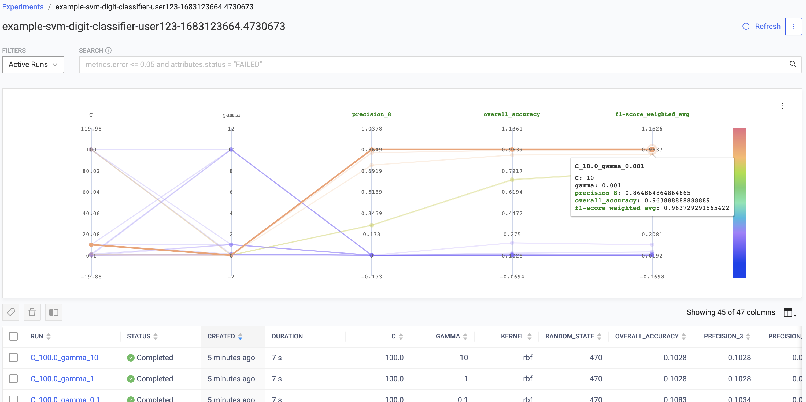
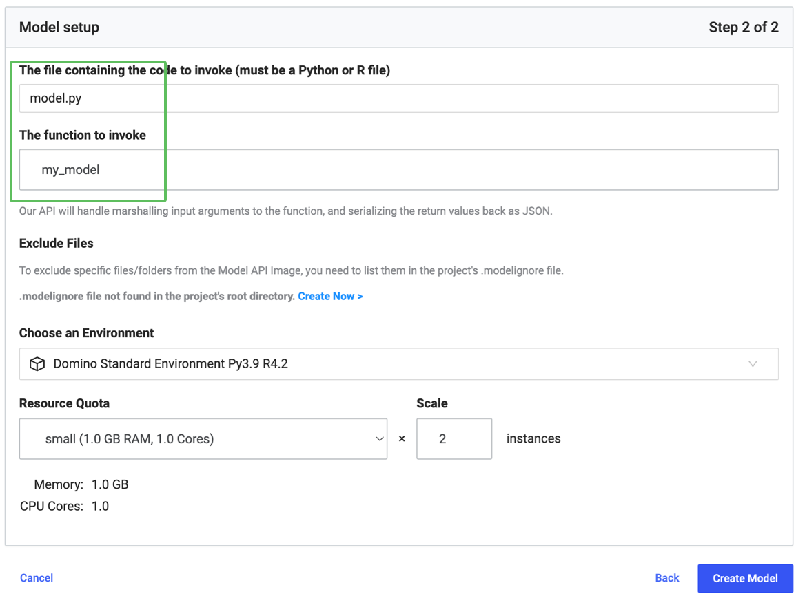

Welcome to your very own quick-start project! This project has examples for running your notebook using workspaces, publishing models as APIs, and publishing Python/Flask and R/Shiny web applications.

### Run your first notebook
You can run interactive tools like Jupyter Notebooks and RStudio inside a Domino Workspace. Workspace is where you would do most of your research. 

Check out our sample Jupyter notebook `main.ipynb` or `iris.R` by running it inside the workspace.

#### Perform your first experiment

The `experiment.ipynb` Jupyter notebook shows an example of how you can use the Experiments feature to train and compare models.

Run it inside the workspace, and then compare the runs in the Experiment tab.

  

#### Example from the Experiments tab after running the `experiment.ipynb` notebook code

---

### Publish a Model as an API
Domino models are REST API endpoints that run your Domino code. We’ve created a sample model for you. Check out these quick instructions and publish your sample model in no time!

Enter `model.py` or `model.R` in the file field. Enter `my_model` in the function field, and hit ‘Create Model’.

---

### Publish an App
You can also use Domino to deploy a web app to publish dashboards and enable broader data and information sharing. 

This project contains a few examples of apps that can be published: `app.R`, `app-flask.py`, `app-dash.py`. `app.sh` is the file that specifies which app to run. You can find all these in the [Files](browse) section.

Try publishing the sample app we’ve created for you.

